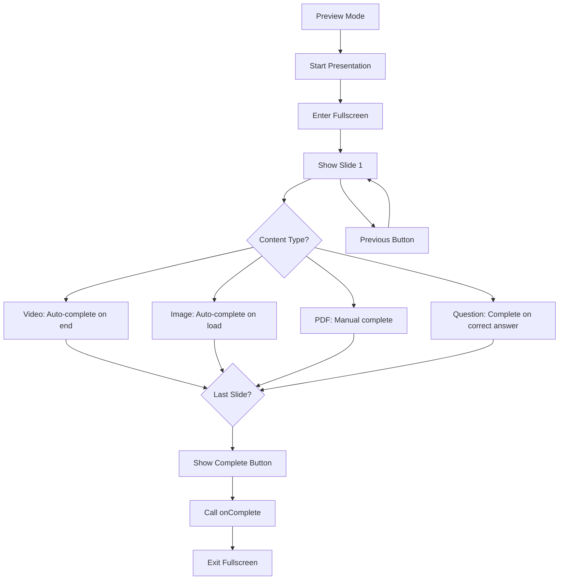

# Slideshow Component Implementation Guide

## Overview

The Buzz Academy Slideshow Component is a comprehensive multimedia presentation system that supports interactive course content delivery across web and native platforms. It handles multiple slide types including videos, images, PDFs, and interactive quiz questions with full-screen capabilities and progress tracking.

## Table of Contents

1. [Architecture Overview](#architecture-overview)
2. [Component Structure](#component-structure)
3. [Slide Types and Content](#slide-types-and-content)
4. [Core Hooks and Logic](#core-hooks-and-logic)
5. [Platform-Specific Implementations](#platform-specific-implementations)
6. [User Experience Flow](#user-experience-flow)
7. [Progress Tracking](#progress-tracking)
8. [Interactive Features](#interactive-features)
9. [Performance Optimizations](#performance-optimizations)
10. [Integration Examples](#integration-examples)

## Architecture Overview

### Core Components

```
SlidePresentation (Main Component)
├── useSlideshowLogic (Core Logic Hook)
├── useFullscreen (Platform-specific fullscreen)
├── useMediaHandlers (Media event handlers)
└── Content Renderers (PDF, Video, Image, Question)
```

### Key Features

- **Multi-platform Support**: Web and React Native implementations
- **Multiple Content Types**: Videos, images, PDFs, and interactive questions
- **Full-screen Mode**: Immersive presentation experience
- **Progress Tracking**: Visual indicators and completion states
- **Touch/Keyboard Navigation**: Intuitive controls for different platforms
- **Responsive Design**: Adapts to different screen sizes and orientations

## Component Structure

### Main Component Props

```typescript
interface SlidePresentationProps {
  unit: CourseUnit;           // The course unit containing materials
  materials: CourseMaterial[]; // Array of materials to display as slides
  onComplete: () => void;     // Callback when all slides are completed
}
```

### Component States

```typescript
interface ComponentState {
  isPreviewMode: boolean;     // Shows preview before starting slideshow
  currentSlideIndex: number;  // Current slide position
  completedSlides: Set<number>; // Track completed slides
  selectedAnswer: number | null; // For quiz questions
  showAnswerFeedback: boolean; // Show question results
  isAnswerCorrect: boolean | null; // Question correctness
}
```

## Slide Types and Content

### Supported Slide Types

#### 1. Video Slides
```typescript
interface VideoSlide extends SlideContent {
  type: 'video';
  url: string;           // Video file URL
  name: string;          // Display name
}
```

**Features:**
- Native video controls
- Auto-completion on video end
- Platform-specific video players
- Aspect ratio preservation

#### 2. Image Slides
```typescript
interface ImageSlide extends SlideContent {
  type: 'image';
  url?: string;          // Image file URL
  name?: string;         // Display name
}
```

**Features:**
- Auto-completion on image load
- Responsive scaling with `object-contain`
- Fallback content display
- Support for unit text content

#### 3. PDF Slides
```typescript
interface PdfSlide extends SlideContent {
  type: 'pdf';
  url: string;           // PDF file URL
  name?: string;         // Display name
}
```

**Features:**
- Integrated PDF viewers
- Page navigation (PDF.js on web, react-native-pdf on iOS)
- Zoom and scroll controls
- Auto-completion on load

#### 4. Question Slides
```typescript
interface QuestionSlide extends SlideContent {
  type: 'question';
  name?: string;
  question: {
    question: string;           // Question text
    options: string[];          // Multiple choice options
    correctAnswer: number;      // Index of correct answer (0-based)
    explanation?: string;       // Explanation after answering
  };
}
```

**Features:**
- Interactive multiple-choice questions
- Immediate feedback on submission
- Retry capability for incorrect answers
- Progress blocking until correct answer

### Content Processing

Materials are converted to slides through the `useSlideshowLogic` hook:

```typescript
// Material type detection and slide creation
materials.forEach(material => {
  if (material.isVideo) {
    slides.push({ type: 'video', url: material.url, name: material.name });
  } else if (material.isImage) {
    slides.push({ type: 'image', url: material.url, name: material.name });
  } else if (material.isPDF) {
    slides.push({ type: 'pdf', url: material.url, name: material.name });
  } else if (material.type === 'question') {
    // Decode Base64-encoded question data
    const question = decodeQuestionFromUrl(material.url);
    slides.push({ type: 'question', question, name: material.name });
  }
});
```

## Core Hooks and Logic

### useSlideshowLogic Hook

The core logic hook manages all slideshow state and behavior:

```typescript
interface UseSlideshowLogicReturn {
  // State
  currentSlideIndex: number;
  slideContents: SlideContent[];
  completedSlides: Set<number>;
  selectedAnswer: number | null;
  showAnswerFeedback: boolean;
  isAnswerCorrect: boolean | null;

  // Computed values
  currentSlide: SlideContent | undefined;
  isLastSlide: boolean;
  isCurrentSlideCompleted: boolean;
  progressPercentage: number;

  // Actions
  handleNextSlide: () => void;
  handlePreviousSlide: () => void;
  handleAnswerSubmit: () => void;
  setSelectedAnswer: (answer: number | null) => void;
  markSlideCompleted: (slideIndex: number) => void;
  resetQuestionState: () => void;
}
```

**Key Logic:**

1. **Slide Conversion**: Transforms `CourseMaterial[]` into `SlideContent[]`
2. **Progress Management**: Tracks completion state for each slide
3. **Question Handling**: Manages quiz interaction and validation
4. **Navigation Control**: Handles slide transitions with validation

### useFullscreen Hook

Platform-specific fullscreen management:

```typescript
// Web Implementation
const enterFullScreen = useCallback(async () => {
  if (fullScreenRef.current) {
    await fullScreenRef.current.requestFullscreen();
    setIsFullScreen(true);
  }
}, []);

// Native Implementation (iOS)
const enterFullScreen = useCallback(async () => {
  await ScreenOrientation.lockAsync(
    ScreenOrientation.OrientationLock.LANDSCAPE
  );
  StatusBar.setHidden(true);
  setIsFullScreen(true);
}, []);
```

### useMediaHandlers Hook

Handles media loading and completion events:

```typescript
const handleVideoEnd = useCallback((slideIndex?: number) => {
  const targetIndex = slideIndex ?? currentSlideIndex;
  markSlideCompleted(targetIndex); // Mark as completed
}, [markSlideCompleted, currentSlideIndex]);

const handleImageLoad = useCallback(() => {
  markSlideCompleted(currentSlideIndex); // Auto-complete on load
}, [markSlideCompleted, currentSlideIndex]);
```

## Platform-Specific Implementations

### Web Implementation

**Technologies:**
- React with TypeScript
- HTML5 Video/Audio APIs
- PDF.js for PDF rendering
- CSS Fullscreen API

**Key Features:**
- Browser-native fullscreen API
- Keyboard navigation support
- Touch/swipe gesture support
- Responsive design with Tailwind CSS

**UI Components:**
- Preview mode with blurred background
- Progress bar and slide counter
- Navigation buttons and floating controls
- Question interaction with visual feedback

### Native iOS Implementation

**Technologies:**
- React Native with Expo
- `expo-video` for video playback
- `react-native-pdf` for PDF rendering
- `expo-screen-orientation` for fullscreen

**Key Features:**
- Native iOS fullscreen with orientation lock
- Status bar management
- Platform-specific gesture handling
- Native video controls with Expo Video

**Platform Differences:**
- Orientation-based fullscreen (landscape lock)
- Native touch gestures
- iOS-specific UI patterns
- Different PDF rendering library

## User Experience Flow

### 1. Preview Mode
- Shows blurred preview of first slide
- Large play button overlay
- Click/tap to start presentation
- Displays unit information

### 2. Presentation Mode
- Full-screen immersive experience
- Progress indicator at top
- Slide navigation controls
- Content-specific interactions

### 3. Content Interaction

**Video Slides:**
```
Load → Play Controls Available → Video Ends → Auto-complete → Next Available
```

**Image Slides:**
```
Load → Auto-complete → Next Available
```

**PDF Slides:**
```
Load → User Navigation → Manual Complete Button → Next Available
```

**Question Slides:**
```
Load → Show Question → User Selects Answer → Submit → Show Feedback
    ↓ (Correct)
Auto-complete → Next Available
    ↓ (Incorrect)
Retry Option → Reset State
```

### 4. Navigation Flow



## Progress Tracking

### Completion Logic

Each slide type has specific completion criteria:

```typescript
const getCompletionCriteria = (slideType: SlideType): CompletionCriteria => {
  switch (slideType) {
    case 'video': return 'on_video_end';
    case 'image': return 'on_load';
    case 'pdf': return 'manual'; // User clicks continue
    case 'question': return 'on_correct_answer';
    default: return 'manual';
  }
};
```

### Progress Calculation

```typescript
const progressPercentage = slideContents.length > 0
  ? ((currentSlideIndex + 1) / slideContents.length) * 100
  : 0;

// Alternative: Based on completed slides
const completionPercentage = (completedSlides.size / slideContents.length) * 100;
```

### Unit Completion

The slideshow triggers unit completion when all slides are completed:

```typescript
useEffect(() => {
  if (completedSlides.size === slideContents.length && slideContents.length > 0) {
    onComplete(); // Mark unit as completed
  }
}, [completedSlides, slideContents.length, onComplete]);
```

## Interactive Features

### Navigation Controls

#### Keyboard Navigation (Web)
```typescript
useEffect(() => {
  const handleKeyPress = (event: KeyboardEvent) => {
    if (isFullScreen) {
      switch (event.key) {
        case 'ArrowLeft':
          handlePreviousSlide();
          break;
        case 'ArrowRight':
        case ' ': // Spacebar
          if (isCurrentSlideCompleted) handleNextSlide();
          break;
        case 'Escape':
          exitFullScreen();
          break;
      }
    }
  };

  document.addEventListener('keydown', handleKeyPress);
  return () => document.removeEventListener('keydown', handleKeyPress);
}, [isFullScreen, isCurrentSlideCompleted]);
```

#### Touch Gestures (Mobile)
```typescript
// Swipe left/right for navigation
const onSwipe = (direction: 'left' | 'right') => {
  if (direction === 'left' && isCurrentSlideCompleted) {
    handleNextSlide();
  } else if (direction === 'right') {
    handlePreviousSlide();
  }
};
```

### Fullscreen Floating Controls

When in fullscreen mode, floating navigation buttons appear:

```tsx
{/* Full-screen Floating Navigation */}
{isFullScreen && (
  <div className="fixed inset-0 pointer-events-none z-50">
    {/* Previous Button - Left side */}
    {currentSlideIndex > 0 && (
      <button
        onClick={handlePreviousSlide}
        className="absolute left-4 top-1/2 -translate-y-1/2 p-4 bg-black/70 hover:bg-black/90 text-white rounded-full"
      >
        <ChevronLeftIcon className="text-4xl" />
      </button>
    )}

    {/* Next Button - Right side */}
    {!isLastSlide && isCurrentSlideCompleted && (
      <button
        onClick={handleNextSlide}
        className="absolute right-4 top-1/2 -translate-y-1/2 p-4 bg-black/70 hover:bg-black/90 text-white rounded-full"
      >
        <ChevronRightIcon className="text-4xl" />
      </button>
    )}
  </div>
)}
```

## Performance Optimizations

### Lazy Loading

Slides are only rendered when active:

```typescript
const currentSlide = slideContents[currentSlideIndex];
// Only render currentSlide content, not all slides at once
```

### Memory Management

- **Cleanup Event Listeners**: Proper cleanup in useEffect returns
- **Video Resource Management**: Release video resources when unmounting
- **Image Preloading**: Optional preloading for smoother transitions

### State Optimization

```typescript
// Use Set for O(1) lookup performance
const completedSlides = useState<Set<number>>(new Set());

// Memoized computed values
const progressPercentage = useMemo(() => {
  return slideContents.length > 0
    ? ((currentSlideIndex + 1) / slideContents.length) * 100
    : 0;
}, [currentSlideIndex, slideContents.length]);
```

## Integration Examples

### Basic Usage in Lesson Player

```tsx
function LessonPlayer() {
  // ... other state management ...

  const handleUnitComplete = useCallback(() => {
    // Mark unit as completed in database
    markUnitCompleted(unitId, userId, courseId);

    // Navigate to next unit or show completion modal
    navigateToNextUnit();
  }, [unitId, userId, courseId]);

  return (
    <div>
      {/* Other lesson content */}
      <SlidePresentation
        unit={selectedUnit}
        materials={getMaterials(selectedUnit)}
        onComplete={handleUnitComplete}
      />
    </div>
  );
}
```

### Custom Material Processing

```tsx
// Custom material filtering or transformation
const processedMaterials = useMemo(() => {
  return getMaterials(unit).filter(material => {
    // Skip certain material types for specific units
    if (unit.unit_number === 1 && material.type === 'question') {
      return false; // No questions on first unit
    }
    return true;
  });
}, [unit]);

<SlidePresentation
  unit={unit}
  materials={processedMaterials}
  onComplete={onComplete}
/>
```

### Progress Integration

```tsx
// Sync with external progress tracking
useEffect(() => {
  if (slideshowLogic.completedSlides.size > 0) {
    // Update external progress state
    updateProgress({
      unitId: unit.id,
      completedSlides: Array.from(slideshowLogic.completedSlides),
      currentSlide: slideshowLogic.currentSlideIndex
    });
  }
}, [slideshowLogic.completedSlides, slideshowLogic.currentSlideIndex]);
```

## Error Handling and Edge Cases

### Network Failures

```typescript
const handleMediaError = (error: Error, slideIndex: number) => {
  console.error(`Media loading failed for slide ${slideIndex}:`, error);

  // Fallback: Mark as completed anyway or show error state
  if (error.message.includes('network')) {
    markSlideCompleted(slideIndex); // Allow progression
  }
};
```

### Invalid Question Data

```typescript
const decodeQuestion = (url: string): Question | null => {
  try {
    const decoded = getQuestionFromUrl(url);
    if (!decoded || !decoded.question_text || !decoded.options?.length) {
      console.warn('Invalid question data, using fallback');
      return {
        question: 'Question data could not be loaded',
        options: ['Continue'],
        correctAnswer: 0,
        explanation: 'Please continue to the next slide.'
      };
    }
    return decoded;
  } catch (error) {
    console.error('Question decoding failed:', error);
    return null;
  }
};
```

## Testing and Debugging

### Component Testing

```typescript
// Mock data for testing
const mockUnit: CourseUnit = {
  id: 'unit-1',
  title: 'Introduction to Drones',
  content: 'Welcome to drone piloting...',
  unit_number: 1
};

const mockMaterials: CourseMaterial[] = [
  {
    index: 0,
    url: 'https://example.com/video.mp4',
    name: 'Intro Video',
    type: 'video',
    isVideo: true,
    isImage: false,
    isPDF: false
  }
];

// Test component rendering
render(
  <SlidePresentation
    unit={mockUnit}
    materials={mockMaterials}
    onComplete={() => console.log('Completed')}
  />
);
```

### Debug Information

```typescript
// Add debug logging in development
if (__DEV__) {
  console.log('Slideshow Debug:', {
    currentSlideIndex: slideshowLogic.currentSlideIndex,
    totalSlides: slideshowLogic.slideContents.length,
    completedSlides: Array.from(slideshowLogic.completedSlides),
    progress: slideshowLogic.progressPercentage,
    currentSlide: slideshowLogic.currentSlide
  });
}
```

## Future Enhancements

### Planned Features

1. **Slide Transitions**: Smooth animations between slides
2. **Thumbnail Navigation**: Visual slide picker
3. **Bookmarking**: Save progress and resume later
4. **Collaborative Viewing**: Multi-user presentations
5. **Analytics**: Detailed engagement metrics
6. **Accessibility**: Screen reader support and keyboard navigation
7. **Offline Mode**: Download content for offline viewing

### Performance Improvements

1. **Virtual Scrolling**: For presentations with many slides
2. **Content Preloading**: Predictive loading of adjacent slides
3. **Compression**: Optimize media file sizes
4. **CDN Integration**: Global content delivery

This slideshow component provides a robust, cross-platform solution for delivering interactive course content with comprehensive progress tracking and user engagement features.